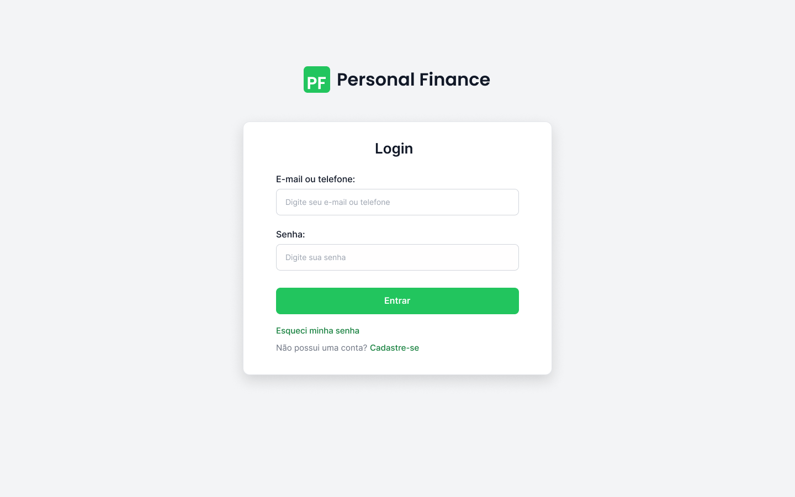
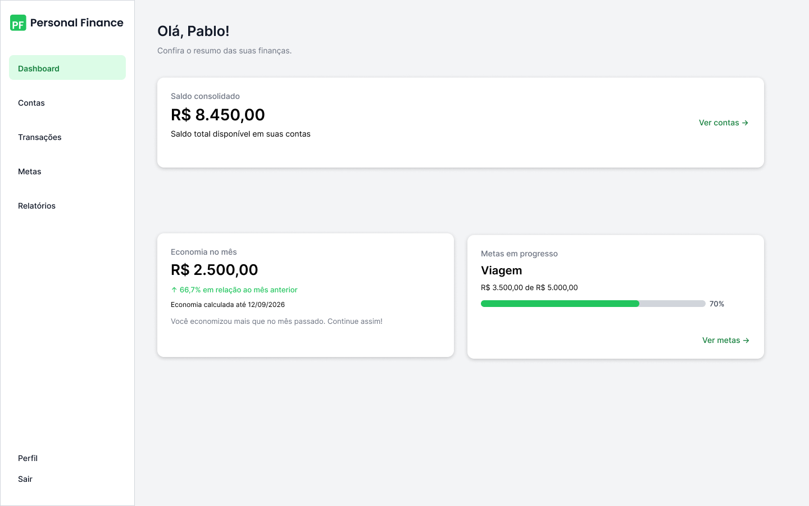
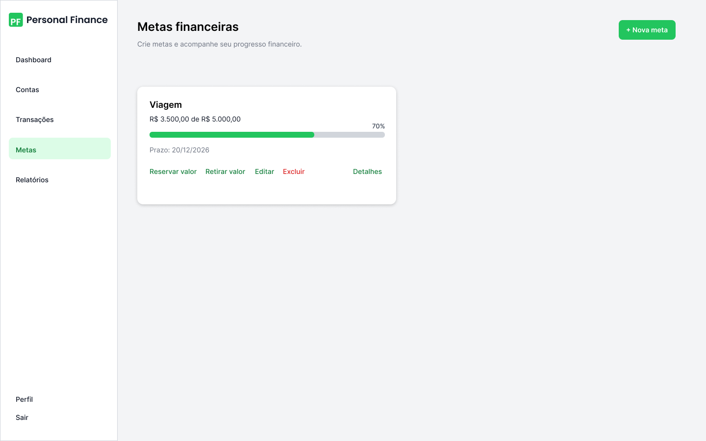

# Personal Finance

## Descrição
O Personal Finance é um sistema web desenvolvido para auxiliar pessoas no controle de suas finanças pessoais.

O sistema permitirá que cada usuário gerencie suas receitas, despesas, contas financeiras e metas, além de acompanhar sua evolução financeira por meio de uma interface simples, organizada e segura.

---

## Objetivo do Projeto
Desenvolver uma aplicação Full Stack utilizando Java como principal linguagem de programação, aplicando conceitos de Programação Orientada a Objetos (POO), Spring Boot, banco de dados relacionais, Git e boas práticas de desenvolvimento de software.

O projeto está sendo desenvolvido individualmente com o objetivo de aprofundar meus conhecimentos em desenvolvimento backend com Java, além de colocar em prática todas as etapas de construção de uma aplicação web completa, incluindo análise, modelagem, implementação, testes e documentação.

## Tecnologias ⚙️
**Backend:** Java 21, Spring Boot e Maven.

**Frontend:** React e TypeScript.

**Banco de dados:** MySQL, Spring Data JPA e Flyway.

**Segurança:** Spring Security.

**Testes:** JUnit e Mockito.

**Versionamento:** Git e GitHub.

**Infraestrutura (planejada):** Docker e GitHub Actions.

## Arquitetura 🏗️
O sistema adotará uma arquitetura monolítica modular, organizada por funcionalidades e com separação de responsabilidades em camadas.

O frontend e o backend serão independentes, comunicando-se por meio de uma API REST.

As decisões arquiteturais estão documentadas em [Arquitetura de Software](docs/06-arquitetura/arquitetura.md).

## Protótipos 🎨

### Login

### Dashboard

### Metas Financeiras

## Status do Projeto 🚧
**Em desenvolvimento — início da implementação.**

A etapa de planejamento e modelagem foi concluída, incluindo requisitos, regras de negócio, casos de uso, fluxogramas, MER, DER, protótipos e arquitetura inicial.

O projeto está entrando na fase de implementação, que será realizada incrementalmente, seguindo a ordem dos protótipos.

Cada funcionalidade será desenvolvida de ponta a ponta, contemplando frontend, backend, banco de dados, integração e testes.

## Documentação 📚

A documentação do projeto está organizada nas seguintes seções:

- [Requisitos Funcionais](docs/01-requisitos-funcionais/01-requisitos-funcionais.md)
- [Requisitos Não Funcionais](docs/02-requisitos-nao-funcionais/02-requisitos-nao-funcionais.md)
- [Regras de Negócio](docs/03-regras-de-negocio/03-regras-de-negocio.md)
- [Casos de Uso](docs/04-casos-de-uso/)
- [Diagramas](docs/05-diagramas/)
- [Protótipos das Telas](docs/06-prototipos/)
- [Arquitetura de Software](docs/07-arquitetura/arquitetura.md)
